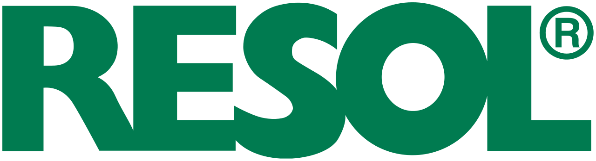
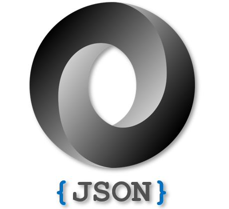

<div id="top"></div>

<!-- PROJECT SHIELDS -->
<!--
*** I'm using markdown "reference style" links for readability.
*** Reference links are enclosed in brackets [ ] instead of parentheses ( ).
*** See the bottom of this document for the declaration of the reference variables
*** for contributors-url, forks-url, etc. This is an optional, concise syntax you may use.
*** https://www.markdownguide.org/basic-syntax/#reference-style-links
-->
[![Contributors][contributors-shield]][contributors-url]
[![Forks][forks-shield]][forks-url]
[![Stargazers][stars-shield]][stars-url]
[![Issues][issues-shield]][issues-url]
[![MIT License][license-shield]][license-url]
[![LinkedIn][linkedin-shield]][linkedin-url]


<!-- PROJECT LOGO -->
<br />
<div align="center">
  <a href="https://github.com/CoMPlest/resol-json">
    
    
  </a>

<h3 align="center">RESOL-JSON</h3>

  <p align="center">
    Live JSON data server for RESOL VBUS
    <br />
    <br />
    <a href="https://github.com/CoMPlest/resol-json/issues">Report Bug</a>
    ·
    <a href="https://github.com/CoMPlest/resol-json/issues">Request Feature</a>
  </p>
</div>
 


<!-- TABLE OF CONTENTS -->
<details>
  <summary>Table of Contents</summary>
  <ol>
    <li>
      About The Project
      <ul>
        <li><a href="#built-with">Built With</a></li>
      </ul>
    </li>
    <li>
      <a href="#getting-started">Getting Started</a>
      <ul>
        <li><a href="#prerequisites">Prerequisites</a></li>
        <li><a href="#installation">Installation</a></li>
      </ul>
    </li>
    <li><a href="#contributing">Contributing</a></li>
    <li><a href="#license">License</a></li>
    <li><a href="#contact">Contact</a></li>
  </ol>
</details>


### Built With

* [![Node.js][Nodejs]][Node-url]
* [![Resol VBus][ResolVbus]][ResolVbus-url]

<p align="right">(<a href="#top">back to top</a>)</p>


<!-- GETTING STARTED -->
## Getting Started

In order to use this app you need a RESOL heat exchanger system with a VBus/Lan adapter. This small node application allows you to integrate your RESOL system into any home automation system like HomeAssistant with a bit of work.

### Prerequisites

In order to use the application you need [node.js][Node-url] and npm installed on your system OR you could user the provided Dockerfile to build a docker image.

### Installation

1. Clone the repo
   ```sh
   git clone https://github.com/CoMPlest/resol-json.git
   ```
2. Install any dependencies with npm
   ```sh
   cd resol-json
   npm install
   ```
3. Edit the configuration file `src/config.js`
   ```js
   const config = {
        httpPort: 3333,
        loggingInterval: 10000,
        loggingFilename: path.resolve(__dirname, 'live-data.json'), /* Here you can specify a live-data file */
        connectionClassName: 'TcpConnection',
        connectionOptions: {
            host: '<YOUR_VBUS_IP>',
            password: 'vbus', /* Default password should by vbus */
        }
    };
   ```
4. Start your application
   ```sh
   npm start
   ```

5. Go to `http://localhost:3333/api/v1/live-data` to see live data


<p align="right">(<a href="#top">back to top</a>)</p>


<!-- USAGE EXAMPLES -->
## Docker

Use this space to show useful examples of how a project can be used. Additional screenshots, code examples and demos work well in this space. You may also link to more resources.


<p align="right">(<a href="#top">back to top</a>)</p>


<!-- CONTRIBUTING -->
## Contributing

Contributions are what make the open source community such an amazing place to learn, inspire, and create. Any contributions you make are **greatly appreciated**.

If you have a suggestion that would make this better, please fork the repo and create a pull request. You can also simply open an issue with the tag "enhancement".
Don't forget to give the project a star! Thanks again!

1. Fork the Project
2. Create your Feature Branch (`git checkout -b feature/AmazingFeature`)
3. Commit your Changes (`git commit -m 'Add some AmazingFeature'`)
4. Push to the Branch (`git push origin feature/AmazingFeature`)
5. Open a Pull Request

<p align="right">(<a href="#top">back to top</a>)</p>


<!-- LICENSE -->
## License

Distributed under the GPLv3 License. See `LICENSE.txt` for more information.

<p align="right">(<a href="#top">back to top</a>)</p>


<!-- CONTACT -->
## Contact

AAron Szekelyhidi - szekelyhidi.aron@gmail.com

Project Link: [https://github.com/CoMPlest/resol-json](https://github.com/CoMPlest/resol-json)

<p align="right">(<a href="#top">back to top</a>)</p>


<!-- MARKDOWN LINKS & IMAGES -->
<!-- https://www.markdownguide.org/basic-syntax/#reference-style-links -->
[contributors-shield]: https://img.shields.io/github/contributors/CoMPlest/resol-json.svg?style=for-the-badge
[contributors-url]: https://github.com/CoMPlest/resol-json/graphs/contributors
[forks-shield]: https://img.shields.io/github/forks/CoMPlest/resol-json.svg?style=for-the-badge
[forks-url]: https://github.com/CoMPlest/resol-json/network/members
[stars-shield]: https://img.shields.io/github/stars/CoMPlest/resol-json.svg?style=for-the-badge
[stars-url]: https://github.com/CoMPlest/resol-json/stargazers
[issues-shield]: https://img.shields.io/github/issues/CoMPlest/resol-json.svg?style=for-the-badge
[issues-url]: https://github.com/CoMPlest/resol-json/issues
[license-shield]: https://img.shields.io/github/license/CoMPlest/resol-json.svg?style=for-the-badge
[license-url]: https://github.com/CoMPlest/resol-json/blob/master/LICENSE.txt
[linkedin-shield]: https://img.shields.io/badge/-LinkedIn-black.svg?style=for-the-badge&logo=linkedin&colorB=555
[linkedin-url]: https://linkedin.com/in/aron-szekelyhidi/
[product-screenshot]: images/screenshot.png
[Nodejs]: https://img.shields.io/badge/node.js-215732?style=for-the-badge&logo=nodedotjs&logoColor=white
[Node-url]: https://nodejs.org/
[ResolVbus]: https://img.shields.io/badge/ResolVbus-20232A?style=for-the-badge&logo=GitHub
[ResolVbus-url]: https://github.com/danielwippermann/resol-vbus
